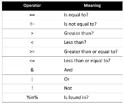

# Module 3: Programming Fundamentals in R
## Learning Objectives
* Conditions and loops
* Functions in R
* Objects and Classes
* Debugging

## Video 3.1: Conditions and Loops
### Conditional Statement
* to select
```R
# if statement
movie_year <-2002
if (movie_year > 2000) {
    print('Movie year is greater than 2000')
}
```
```R
# if-else
if (movie_year > 2000) {
    print('yes')
} 
else {
    print('no')
}
```
### Logical Operators
  
### For Loops
* Used to cycle through all the values in a vector

```R
years <- c(1995,1998,1985,2011,1936,1999)

for (yr in years) {
    print(yr)
}
```
* Can combine:
```R
for (yr in years) {
    
    if (yr < 1980) {
        print('old movie')
    }
    else {
        print('not that old')
    }

}
```
### While loops
* continues to execute as long as the condition in the parenthesis stays true
* useful when you don't know how many times loop will run
```R
# controlled by variable "count"
count <- 1
while (count <= 5) {
    print(c("iteration: ", count))
    count <- count +1
}
```
[link to lab](./Lab3a-Conditions_Loops.ipynb)

## Video 3.2: Functions in R
### Functions in R
* Function: reusable block of code
    * Pre-defined functions
    * User-defined functions
* Pre-defined functions
```R
# built into R:
ratings <- c(10,9,7,10)
mean(ratings)
sort(ratings, decreasing = TRUE)
```
* User-defined fucntions

```R
# create function
printHelloWorld <- function() {
    print("Hello World")
}

# call function
printHelloWorld()

# create value-needed functions
add <- function(x, y){
    return(x +y)
}

#call funtion
add(3,4)
```
* condition-based functions

```R
# if-else nested function
isGoodRating <- function(rating) {
    if (rating < 7) {
        return("NO")
    } else {
        return("YES")
    }
}

#call function
isGoodRating(6)
```
* set a default/threshold
```R

isGoodRating <- function(rating, threshold = 7) {
    if(rating < threshold){
        return("NO")
    } else {
        return("YES")
    }
}

# override threshold
# call:
isGoodRating(8, threshold = 8.5)
```
* Function within a Function

```R
watchMovie <- function(moviename, my_treshold = 7){
    rating <- mu_data[my_data[,1]] == moviename, "average rating" isGoodRating(rating, threshold = my_treshold)
}
```
* Global and local variables

```R
# y as a Global variable
myFunction <- function(){
    y <<- 3.14
    temp <- 'Hello World'
    return(temp)
}
```
## Video 3.3: Objects and Classes
### Objects in R
* An object is a data structure that has attributes and methods that act on those attributes
* Object classes
    * Numeric
    * Character
    * Logical
    * Integer
    * Complex
    * matrix
    * data.frame
* Check class
```R
class(variable)
```
## Video 3.4: Debugging
### Producing an error
* Errors can be generated by performing methods on different classes
* tryCatch statement
