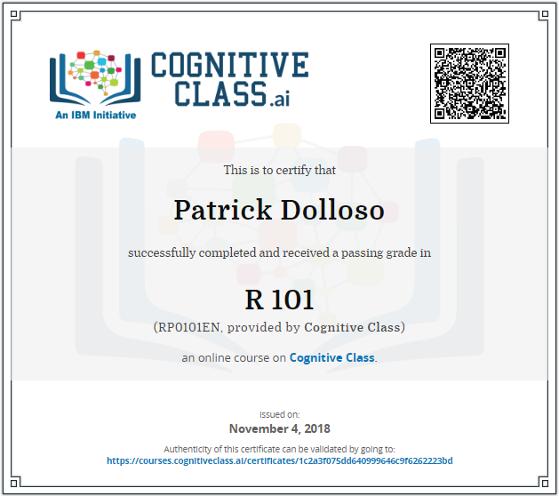

# IBM Certification: R 101
## Overview
  
* Author: Patrick Dolloso
* Date obtained: Nov 4 2018
* Link: [IBM Certificate R 101](https://courses.cognitiveclass.ai/certificates/1c2a3f075dd640999646c9f6262223bd)
* This repository contains notes and projects during my completion of the IBM certification in R 101
### Directory
1. [R Basics](./1-R-Basics/readme.md)
2. [Data Structures in R](./2-R-Data-Structures/readme.md)
3. [R Programming Fundamentals](./3-R-Programming-Fundamentals/readme.md)
4. [Working with Data in R](./4-Working-with-Data/readme.md)
5. [Strings and Dates with R](./5-Strings-and-Dates/readme.md)
6. [Projects](./Projects/readme.md)
### Why R?
    * Free and open source
    * Built for statistical computing
    * Visualization Tools
    * Tools for building models
### Learning Objectives
* The basics of R
* Writing R scripts
* R syntax
* Vectors, lists, matrix, arrays, and dataframes
* Reading and writing data in R